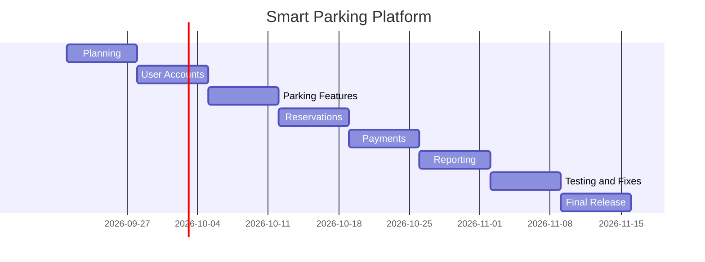

# 1. Existing Software Landscape

Before I started building, I wanted to know what already existed, so I looked at similar parking apps and found 3 called ParkMobile, SpotHero, and ParkWhiz.

Parkmobile allows people to find and pay for parking using their cell phones. At some locations customers can reserve a parking space in advance and have notifications about parking time. I thought that was especially useful because many people struggled with time management regarding parking because its unforseen. One thing I thought about was that some features could be different depending on the location.

SpotHero is more geared towards booking parking in advance. Users can look around where they need to be, compare the parking options and prices, reserve parking, and pay by the app. I thought this would be really useful if someone needed to park at an airport or was going to an event because they could figure out their parking before they even got there.

ParkWhiz works the same way. Users can search and find parking near their destination, compare parking offers, reserve parking, and pay online. It also gives the customer information about the parking facility and directions.

## What will be different about our platform?

Many of the ideas we use in the platform are already being used in other places, so I don't feel like it's needed to completely remake the parking app. Instead, the smart parking platform can bring these ideas together and put more focus on real time availability and the parking operator side of the system.

For example, a driver who uses the map can ask for parking information, find a parking garage on the map, book parking, pay, and be directed to parking all in one place. In the same way, the parking operator would be able to see all of the information and reports in their own dashboard, including parking occupancy data. I believe the best application of the platform would be to have both sides linked in a single system.

## 2. Vision and Scope

WE ARE $oftware Corp is an imaginary software development company that has an unlimited budget and resources. The company is going to handle the development of the Smart Parking Platform for this project, planning and managing it.

The idea isn't groundbreaking, but it comes from a really common problem. In busy areas, drivers can spend a very long amount of time looking for a parking space that’s open. This is not only frustrating but can also lead to traffic and cause delays. Parking operators also need to be able to properly track parking usage and the use of their facilities.

The concept of a smart parking platform is to simplify this process for both parties. The system would be available through web and mobile apps. Customers will be able to see available parking, see the parking facility on a map, book the parking space, pay for parking, be sent notifications about their parking or reservation, and get directions to the parking facility. Parking operators will be able to keep track of those customers and get reports through their own dashboard.

## 3. Software Requirements Specification

### Purpose and Scope

The Smart Parking Platform will offer a more convenient and easy way for both the driver to access and use available parking and the parking operator to keep track of their facilities.

It will be accessible via the web and mobile apps. Drivers can check the car park, park availability, reserve a parking, pay for the car park, and see their already made reservations and receipts. The parking operators will be issued with a dashboard that they can use to monitor the parking status and to obtain information on parking.

### Users

The main users of the system will be drivers, vehicle owners, parking facility operators, system administrators, and finance and billing staff. City transportation departments and third party payment providers are among the other stakeholders.

### System Environment

The platform will be web based as well as mobile. It’ll also need a backend system that’ll be able to combine the information on parking use with the apps. Where necessary, outside service providers will be utilized to provide services like maps, navigation, payments, etc.

### Constraints and Assumptions

Time is one of the biggest factors that could constrict the project. We only have the semester to put together everything, even though the assignment's budget is unlimited. In addition, the platform would depend on outside vendors for things like payments, maps, and directions, so we would need to make sure that those services are able to work with our platform. Lastly, we would have to follow parking, security, and privacy laws. For now, I'm assuming that if a parking facility chooses to be a part of the project, they’d be providing the information that shows the availability of parking and their facility in general, which helps.

## 4. Initial Use Cases

These are the first 15 use cases I came up with for the system. 

### 1. Set up an account

If they are new users, they can enter into the platform and register.

### 2. Log In

Registered users can log in to their account.

### 3. Manage Vehicle Information.

A motorist is able to share and update their car details.

### 4. Find the free parking spaces

A driver can search for nearby parking in the vicinity of a location.

### 5. Display the parking availability

A driver is able to find out if parking is available at a participating facility.

### 6. Display a map of the parking area.

A driver can see on a map the availability of parking around him.

### 7. View Parking Details

A driver can obtain data on a parking site, including the price or availability of the site for parking.

### 8. Reserve Parking

The driver can save a parking space for a certain period of time.

### 9. Cancels a reservation

A reservation is cancelled. If canceling is okay, the driver can cancel the booking.

### 10. Pay for parking

The platform has the option of paying for parking.

### 11. View Reservation History

A driver is able to view the latest and previous parking reservations.

### 12. View Receipts

It is possible for a motorist to view a receipt that indicates a parking fee has been paid.

### 13. Receive Notifications

An owner may be notified of their parking or reservation status.

### 14. Get Directions

Using a mapping service, a driver can obtain directions to the chosen parking facility.

### 15. Display a dashboard

The dashboard will provide information on the parking facility's occupancy, reports, and other information to the parking operator.

## 3. Work Breakdown Structure

For the smart parking platform, I broke the project into 4 main parts of the system and then divided those into smaller parts. This helped me see what would actually need to be done for the platform.

### 1. User Accounts

* 1.1 Driver

  * 1.1.1 Register
  * 1.1.2 Login
* 1.2 Parking Operator

  * 1.2.1 Register
  * 1.2.2 Login

### 2. Parking

* 2.1 Find Parking

  * 2.1.1 Search for a garage
  * 2.1.2 View available parking
* 2.2 Garage Management

  * 2.2.1 Add or edit a garage
  * 2.2.2 Update available spaces

### 3. Reservations and Payment

* 3.1 Reservation

  * 3.1.1 Select parking
  * 3.1.2 Confirm reservation
* 3.2 Payment

  * 3.2.1 Enter payment
  * 3.2.2 Payment confirmation

### 4. Reporting

* 4.1 Parking Reports

  * 4.1.1 View occupancy
  * 4.1.2 View occupancy graphs
* 4.2 Financial Reports

  * 4.2.1 View revenue
  * 4.2.2 Export report

## 4. Draft Timeline

I made a simple timeline based on the structure i have. This is just the order that made the most sense for me as of now but it could definitely change later.

| Week   | Project Work                    |
| ------ | ------------------------------- |
| Week 1 | Planning and requirements       |
| Week 2 | User accounts                   |
| Week 3 | Parking search and garage setup |
| Week 4 | Reservations                    |
| Week 5 | Payments                        |
| Week 6 | Reporting                       |
| Week 7 | Testing and fixes               |
| Week 8 | Final release                   |

### Milestones

* Week 2 – User accounts finished
* Week 5 – Reservations and payments finished
* Week 6 – Reporting finishef
* Week 8 – Final project finished

## 5. Gantt Chart

### Estimation

This schedule is just an estimate and could change over time because the project also changes every week and homework too. I think breaking the project into sections and weekly homeoworks really helped make such a complicated project much easier for me and made more sense.

